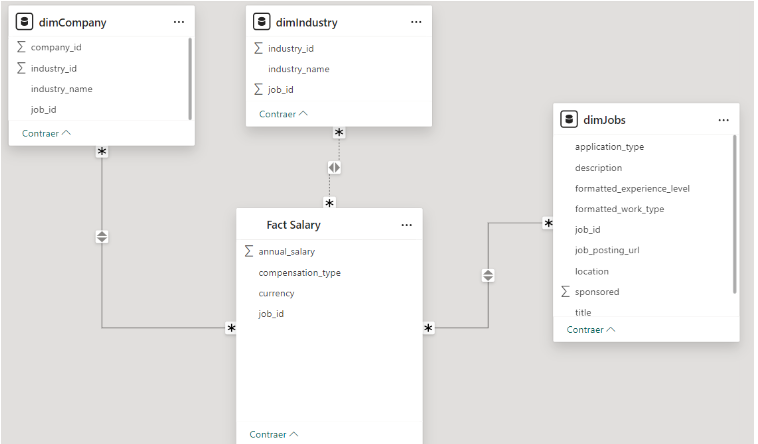

# Linkedin Job Postings - ETL - Part # 1
By: Emmanuel Quintero & María de los Ángeles Amú

## Overview
In this project, we are going to analyze, manipulate and visualize data about job postings in Linkedin, as part of an ETL project. We used SQLAlchemy as an Object-Relational Mapping (ORM) tool connected to PostgreSQL, and we will generate visual representations using PowerBI.

## Tools used

- Python
    
- Pandas
    
- PowerBI
    
- SQLAlchemy
    
- PostgreSQL
    
- Jupyter Notebook

## Repository Organization:
Our repository has a folder called Data, which is where the datasets in xlsx format that we use for the development of the project are. It also has the notebook where all the code and functionalities of the project were created except for the visualizations that were created with Power BI. In the repository there is also the README of the project and the requirements.txt

## Dataset used
For this project, we used 3 datasets, extracted from Kaggle, the first of which was: It contains 28 columns and 33246 rows that correspond to some works published on Linkedin.
The columns names of “job_postings.csv” before data transformation are:

1. job_id: The job ID as defined by LinkedIn

2. company_id: Identifier for the company associated with the job posting (maps to companies.csv)

3. title: Job title.

4. description: Job description.

5. max_salary: Maximum salary

6. med_salary: Median salary

7. min_salary: Minimum salary

8. pay_period: Pay period for salary (Hourly, Monthly, Yearly)

9. formatted_work_type: Type of work (Fulltime, Parttime, Contract)

10. location: Job location

11. applies: Number of applications that have been submitted

12. original_listed_time: Original time the job was listed

13. remote_allowed: Whether job permits remote work

14. views: Number of times the job posting has been viewed

15. job_posting_url: URL to the job posting on a platform

16. application_url: URL where applications can be submitted

17. application_type: Type of application process (offsite, complex/simple onsite)

18. expiry: Expiration date or time for the job listing

19. closed_time: Time to close job listing

20. formatted_experience_level: Job experience level (entry, associate, executive, etc)

21. skills_desc: Description detailing required skills for job

22. listed_time: Time when the job was listed

23. posting_domain: Domain of the website with application

24. sponsored: Whether the job listing is sponsored or promoted.

25. work_type: Type of work associated with the job

28. currency: Currency in which the salary is provided.

29. compensation_type: Type of compensation for the job.

The second data set that we use is called "job_industries" and has 2 columns (job_id and industry_id) where each job is related to an id of an industry. We use this dataset later (section 3) as well as our third dataset (industries). The columns names of “job_industries” before data transformation are:

1. job_id: The job_id column corresponds to the job_id's found in our first dataset
2. industry_id: The industry_id column corresponds to an id assigned to each industry to be related to each job later.

The third data set that we used is called "industries" and has 2 columns (industry_id and industry_name ) where the industry_id is the id corresponding to each industry and the industry_name column is the name associated with that industry_id. The columns names of "industries" before data transdormation are:

1. industry_id: Id assigned to each industry
2. industry_name: Industry name

## Requirements

- Python 3x 

- PostgreSQL 16x (psycopg2)
  
- Openpyxl
  
- Matplotlib
  
- PowerBI desktop
  
- SQLAlchemy
  
- JSON credentials file (keys.json) with the next format:
```json
{
"user": "your_user",
"password": "your_password",
"port": "your_postgres_number_port",
"server": "your_server_address",
"db": "your_database_name"
}
```
## Project Setup

1. Clone de repository:
```bash
https://github.com/mdlangeles/linkedin_job_postings_etl.git
```
2. Go to the project directory:
```bash
cd linkedin_job_postings_etl
```
3. Create a virtual environment:
```bash
python -m venv env
```
4. Activate virtual environment:
```bash
.\venv\Scripts\activate
```
5. Install libraries:
```bash
pip install requirements
```
6. Create a database in PostgreSQL
7. The project have an Jupyter Notebook, "eda.ipynb" and this notebook is divided into 4 sections :
- We recommend you start with section #1: Import the modules, make the connection to the database, and load the data into it.
    ##### Note: In this section, you must change the name of the JSON file to the name of the JSON file that you need to create to be able to make the connection to the database. In our case the name of my file was `keys.json`. If you decide to name your file the same way, remember to change the values specified in the `Database Configuration` field located in the README.
- The second step is to execute section 2, which is where the exploratory analysis carried out on the 3 tables with which we initially worked is located.
- The third step is to run section 3, which is where the merge, imputing & standardization
- The fourth step is to run section 4, which was where we created the new table (our final table) in postgreSQL
  
8. Go to Power BI:

  
8.1 Create a new dashboard.


8.2 Select the option Get/Import data and search PostgresSQL Database


8.3 Insert your PostgreSQL server and your database name and accept:


8.4 If you manage to connect to the database the following will appear:


##### Note: For our analysis and the creation of our visualizations we used the LinkedinSalary table since this table was where the entire imputation, filtering and standardization procedure was carried out. Basically it is our final table

8.6 Congrats!, you can now select the table you want to work with, you can upload it to the dashboard and make your own dashboard

## Our Dashboard
Here is our dashboard: [Our Dashboard](https://app.powerbi.com/view?r=eyJrIjoiNjM2ZTg5NGItMDUwZi00YmRlLTg4M2UtNDRmNjEyZDMwYTU1IiwidCI6IjY5M2NiZWEwLTRlZjktNDI1NC04OTc3LTc2ZTA1Y2I1ZjU1NiIsImMiOjR9)

# Linkedin Job Postings - ETL - Part # 2

## Overview
To carry out the second part of our project, we make our dimensional model from our dataset resulting from the first part of the project. Subsequently, we look for an API to make queries to bring data about more job postings and to be able to further expand our original dataset taking into account its columns. For this second part, we used the same tools used for the development of the first part, only a new one was added, which was Rapid Api, which was where we found the API to bring more job postings.
We also updated the structure of our project by organizing it by folders and added an additional Jupyter Notebook "API_eda" which was where the eda was done to the results of the API, the structural creation of the table in Postgres and finally the insertion of the data into the table

## Dimensional Model

To create our dimensional model we used Power BI and the process was as follows:

1. Verify that you already have the table created (in Postgres) with the transformations
##### Remember: The table with the transformations is the same one that you select to perform the visualizations in step 8.6 in the first part

2. Repeat steps 8, 8.1, 8.2 and 8.3 of the first part, when you have connected to postgres you select the table that was mentioned in the previous step
##### Note: In order to connect to your database you must take into account the json file that you created at the beginning of the project, since there you defined the username, password, port, server (where postgres will run) and the name of the database that are you going to use

3. When selecting the table and loading it, you will right click on it to duplicate it, in our case we made 4 different tables, since we took out our fact table, and 3 dimensions connected to it

4. Having the 4 different tables, what we did was select the columns that each dimension was going to have, including the fact table

Leaving our dimensional model like this:

 

5  Finally, we only make our visualizations by selecting the columns or items of each dimension that we would use to make the graphs.

##### Note: The relationships were made through job_id between the fact table and the dimensions

## API

For the API part it is necessary to have a Google account preferably, it is also worth noting that in order to use an API you have to subscribe to it and take into account the number of requests/queries that it allows you to make to that API from the basic plan (that means free), additionally, some credentials are necessary, which the application gives you once you register to be able to make requests to the API


In our case, we had to create several Google accounts to be able to make several requests, then we had to save those results in a csv to be able to perform the exploratory analysis and based on that analysis, perform the respective transformations from a Jupyter Notebook.

Some transformations were:

- Removal of duplicate data
- Standardization of columns with abbreviated data such as location or type of work
- Salary Outliers (imputing)
- Delete the “remote_ratio” column

Subsequently, the table structure for postgres was created and the transformed data was inserted into the aforementioned table.

We connect to postgres like this in steps 8, 8.1, 8.2 and 8.3, we select the table with the name we gave it when creating it

And now we can make the graphs. This is our API dashboard: [Our API Dashboard](Visualizations/dimensional_model_visual.pdf)
